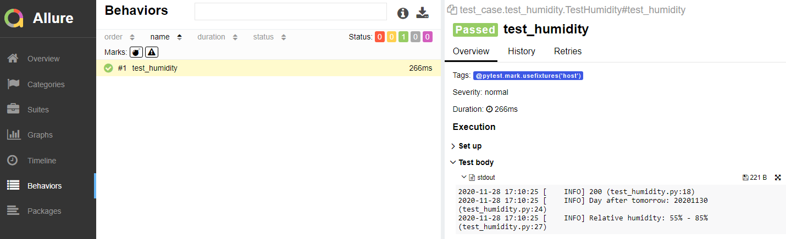

# Setup

## Install Python packages

```
pip install -r requirements.txt
```

## Install Allure

#### For MacOS
```
brew install allure
```

#### For Windows

- Install [Scoop](https://scoop.sh/)

In Powershell run command `iwr -useb get.scoop.sh | iex` to install scoop

- Install [Allure](http://allure.qatools.ru/)

In Powershell run command `scoop install allure`


<br />

# Run Test
```
python main.py
```

Supported arguments
```
--test     | Path of scripts to execute. Default is "test_case" folder
```

<br />

# Show report
In IDE (e.g. PyCharm), right click `/allure-report/index.html` in project file tree, and select "Open in browser -> Chrome"
<br />


<br />

# Structure Design
```
| helper     - helper class and utils
| data       - test data for API testing
| test_case  - test script .py files
```
- BDD style test scripts design (with yml file)
- Dynamic load test data per test function by linking the function name and test case name in yml file
- Automatic logging info attached to Allure report
- Dynamic report and log files generation

<br />

# Test Case Design
#### test_humidity
1. Load test data from yml file
2. Combine request url
3. Send GET request to get weather forecast data
4. Assert response status code to be 200
5. Extract the day after tomorrow
6. Extract the relative humidity of the day after tomorrow
7. Assert the day is correct